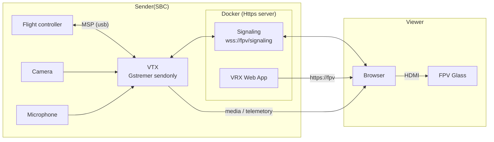
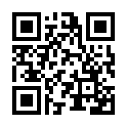
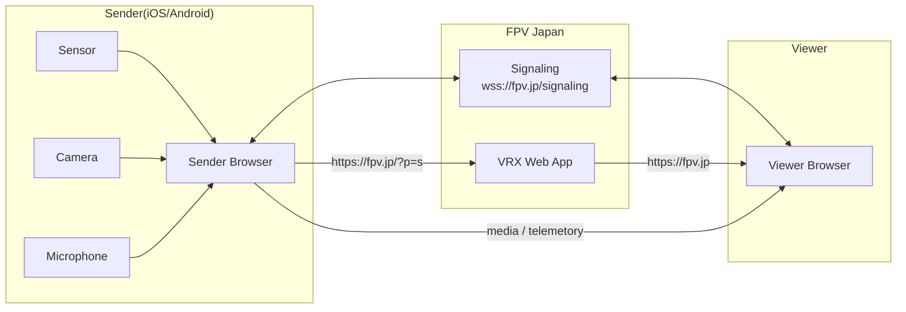
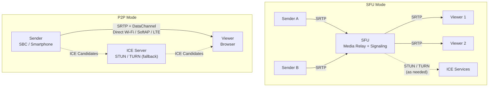

# App

本アプリケーションは、**Raspberry Pi**をはじめとするSBC（single board computer）やスマートフォンを用いて  
**映像・音声のリアルタイム送受信**を実現するWebRTC ベースの配信システムです。  
主に FPV（First PersonView）用途やロボティクスにおけるテレメトリー伝送サービスを提供します。 

## 目次
1. [システム概要](#システム概要)
2. [コンポーネント](#コンポーネント)
3. [サポート構成](#サポート構成)
4. [前提条件](#前提条件)
5. [セットアップ](#セットアップ)
6. [Viewer 設定 (TLS)](#viewer-設定-tls)
7. [運用ガイド](#運用ガイド)
8. [技術仕様](#技術仕様)
9. [テレメトリー](#テレメトリー)

## システム概要
- WebRTC を利用した映像・音声・データチャンネルのリアルタイム伝送。
- P2P（Direct Wi-Fi/SoftAP/LTE）と SFU（Signaling + SFU）を切替可能。
- Docker コンテナで提供され、Signaling/VRX/VTX バイナリを内包。

### SBC（single board computer） の構成



### スマートフォンの場合
1. スマートフォンのブラウザで https://fpv.jp/?p=s を開きます  


2. PCのブラウザで https://fpv.jp を開きます



## コンポーネント
| コンポーネント | 役割 |
| --- | --- |
| Signaling サーバ | WebRTC シグナリング、TLS 終端 |
| VRX Web アプリ | ブラウザ受信 UI、テレメトリー可視化 |
| VTX デーモン | 各 SBC/スマホで動作する配信プロセス |

## サポート構成
### VTX 対応プラットフォーム
| オプション | 対応環境 |
| --- | --- |
| `RPI4_V4L2` | Raspberry Pi 4 + V4L2 |
| `JETSON_NANO_2GB` | NVIDIA Jetson Nano 2GB |
| `JETSON_ORIN_NANO_SUPER` | NVIDIA Jetson Orin Nano Super |
| `RADXA_ROCK_5B` | Radxa ROCK 5B |
| `RADXA_ROCK_5T` | Radxa ROCK 5T |
| `RPI4_LIBCAM` | Raspberry Pi 4 + libcamera |
| `RPI5_LIBCAM` | Raspberry Pi 5 + libcamera |

### 動作モード
| オプション | 説明 |
| --- | --- |
| `P2P` | 端末間直接接続（Direct Wi-Fi/SoftAP/LTE） |
| `SFU` | Signaling + SFU 経由のリレー（開発中） |



> ⚠️ SFU モードは開発中のため本番利用は非推奨。

## 前提条件
- Raspberry Pi 等の SBC もしくは Android/iOS ブラウザ付き端末。
- Docker 20.10 以上。
- TLS を伴うネットワーク経路（LAN/インターネット）。
- `server-ca-cert.pem` を Viewer OS/ブラウザにインポート可能な権限。

## セットアップ
### 1. Docker のインストール（SBC）
```bash
sudo apt update
sudo apt install -y curl
curl -fsSL https://get.docker.com -o get-docker.sh
sudo sh get-docker.sh
sudo usermod -aG docker $USER
```
> 再ログイン後に `docker` が利用可能になります。

### 2. Signaling/VRX の起動
```bash
docker run -it -d \
  --name fpvjp-app \
  -p 443:443 \
  --restart unless-stopped \
  fpvjp/app:latest
```
> コンテナ起動により Signaling サーバと VRX Web アプリが公開されます。

### 3. VTX のセットアップ
```bash
docker cp fpvjp-app:/src/setup.sh .
chmod +x setup.sh
sudo bash setup.sh <PLATFORM> <MODE>
```
使用例:
```bash
sudo bash setup.sh RPI4_V4L2 P2P
```
> `setup.sh` が GStreamer プラグインや環境変数を対象プラットフォーム向けに構成します。

## Viewer 設定 (TLS)
LAN 上で TLS 接続を行うため、自己署名 CA を利用します。既定ホスト名は `fpv` で、`https://fpv` にアクセスします。

1. `/etc/hosts` に SBC の IP とホスト名を追加します。
   ```bash
   sudo vim /etc/hosts
   # 例
   192.168.4.1 fpv
   ```
2. `server-ca-cert.pem` を OS またはブラウザに登録します。
   ```bash
   sudo cp server-ca-cert.pem /usr/local/share/ca-certificates/server-ca-cert.crt
   sudo update-ca-certificates
   ```

## 運用ガイド
- コンテナログ: `docker logs -f fpvjp-app`
- VTX デーモン: `systemctl status fpv-vtx`（セットアップスクリプトがサービス登録）
- 更新手順: 新しいイメージを `docker pull` 後、コンテナを再作成
- トラブルシュート: `webrtc-internals` や `gst-launch-1.0` でストリーム状態を確認

## 技術仕様
### 通信方式
- ネゴシエーション: WebRTC + DTLS-SRTP
- メディア: UDP (RTP/SRTP)、必要に応じて TURN 経由でフォールバック
- P2P モード: 端末間ダイレクト接続、最低遅延
- SFU モード: Signaling + SFU 経由リレー（開発中、インターネット必須）

### コーデック
- 映像: H.264 / H.265 / VP8 / VP9 / AV1（端末サポート依存）
- 音声: Opus / PCMU

### Viewer
- Chrome / Firefox / Safari / Edge 等の最新ブラウザ
- LAN 運用時は独自 CA の証明書を使用

### Sender (スマートフォン)
- ブラウザからカメラ・マイクを取得、VTX デーモン不要

### Sender (SBC)
- `gst-launch-1.0` ベースのパイプライン
- ハードウェアエンコード利用可（例: `v4l2h264enc`, `nvvidconv`）

## テレメトリー
WebRTC DataChannel を使用して機体状態を伝送します。

### スマートフォン
- IMU（加速度/ジャイロ/コンパス）
- GNSS（位置・高度）
- バッテリー情報（ブラウザ対応時）

### SBC / フライトコントローラ
- Betaflight などと接続
- MSP（MultiWii Serial Protocol）で姿勢・モード・バッテリーステータスを取得
